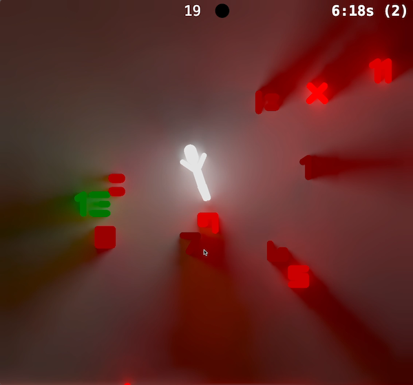

# +- 13

A game built for the 2024 JS13K competition.

# Tech

## Graphics

This game is SDF-based with radiance cascades sprinkled on top. The presentation layer of this engine is an adaptation of Jason McGhee's (jason.today) radiance cascades (https://jason.today/rc). The original is a Three.js implementation provided under the MIT license, and this engine is a port to raw WebGL2.

## Music

Custom Web Audio oscillator based engine
